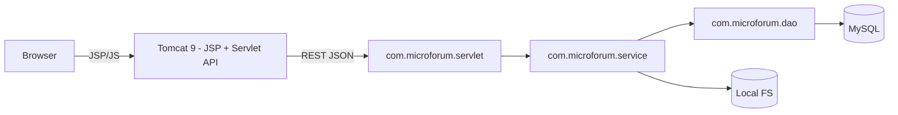

# 项目设计书 — MicroForum

## 基本信息
- **项目名称**：MicroForum
- **技术栈**：Java 11+, Servlet 4.0, Tomcat 9.0, JSP + JSTL 前端（位于 `webapp/WEB-INF/jsp`），JDBC（HikariCP）、MySQL 8、本地文件存储
- **项目定位**：类 Twitter/Instagram 的轻量社交平台，支持文字/图片/视频/外链，支持关注、点赞、评论、转发，前后端严格分离（后端为 Servlet REST 风格 + JSON，前端使用 JSP 渲染页面并通过 AJAX 调用后端 API）
- **部署方式**：本地 Docker Compose（Tomcat + MySQL），WAR 包部署（支持 JSP）

## 设计原则与目标
- **明确分层**：`com.microforum.servlet`（Servlet 控制层）、`com.microforum.service`、`com.microforum.dao`、`com.microforum.entity`、`com.microforum.util`、`com.microforum.filter`。
- **安全优先**：密码使用 BCrypt 哈希、PreparedStatement 防注入、文件类型与大小校验、输出编码防 XSS。
- **媒体本地化**：媒体文件统一存放在配置的 `file.storage.path`，目录按年月与用户分片，命名使用 UUID 防冲突。
- **JSP 前端**：采用 JSP + JSTL 渲染基础页面（首次渲染）并在交互处调用后端 JSON 接口（`/api/*`），保持 UI 响应性与 SEO 友好。
- **易迁移**：数据库、文件分离，配置化（properties 环境变量），便于将来替换为 S3 或云 DB。

## 用户故事（简短）
1. 注册并登录，完善个人资料，上传头像与背景图。
2. 发布帖子（文字 + 可选多媒体），插入外链。
3. 浏览时间线、点赞、评论、转发、关注作者。
4. 管理员可封禁用户、删除帖子与评论。
5. 在局域网内用 Docker 部署并访问。

## 业务流程（简图 mermaid）


## 非功能性需求
- **性能**：分页、索引优化；图片缩略与懒加载。
- **可维护性**：代码注释、清晰包结构、DAO 模式。
- **可测试性**：DAO 与 Service 单元测试；整合测试使用测试 DB。
- **可扩展性**：Service 层支持横向拆分、Media 服务可单独部署。

## 项目目录（IDEA 约定）
```
microforum/
 ├─ src/
 │   └─ main/
 │       ├─ java/
 │       │   └─ com/microforum/
 │       │       ├─ servlet/
 │       │       ├─ service/
 │       │       ├─ dao/
 │       │       ├─ entity/
 │       │       ├─ util/
 │       │       ├─ filter/
 │       │       └─ listener/
 │       └─ resources/
 │           └─ application.properties
 ├─ webapp/
 │   ├─ WEB-INF/
 │   │   ├─ jsp/
 │   │   │   ├─ index.jsp
 │   │   │   ├─ feed.jsp
 │   │   │   ├─ profile.jsp
 │   │   │   ├─ post.jsp
 │   │   │   ├─ create_post.jsp
 │   │   │   └─ admin/
 │   │   └─ web.xml
 │   ├─ static/
 │   │   ├─ css/
 │   │   ├─ js/
 │   │   └─ uploads/  (mapped to file.storage.path)
 └─ pom.xml (或 build.gradle)
```

## 开发与迭代计划（建议）
1. 环境与模板：Tomcat + MySQL + IDEA，生成基本项目骨架与 web.xml。
2. DB 与实体：建表并实现 Entity 类与 DAO（users, posts, media, comments, likes, follows）。
3. 基础服务：Auth（登录/注册会话），File upload（MediaServlet），Post CRUD。
4. 前端 JSP：基础模板、feed、post、profile、create_post。
5. 管理后台：admin 页面与对应 Servlet。
6. 打包与 Docker：构建 WAR，Docker Compose 部署并联调。

## 交付物
- 五份完整需求文档（设计、后端、前端、数据库、部署）
- 示例关键代码片段（UserServlet、PostServlet、UserDao.create()、Media upload）
- Dockerfile 与 docker-compose.yml 模板
